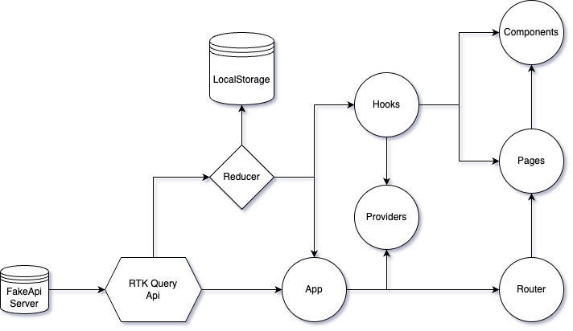
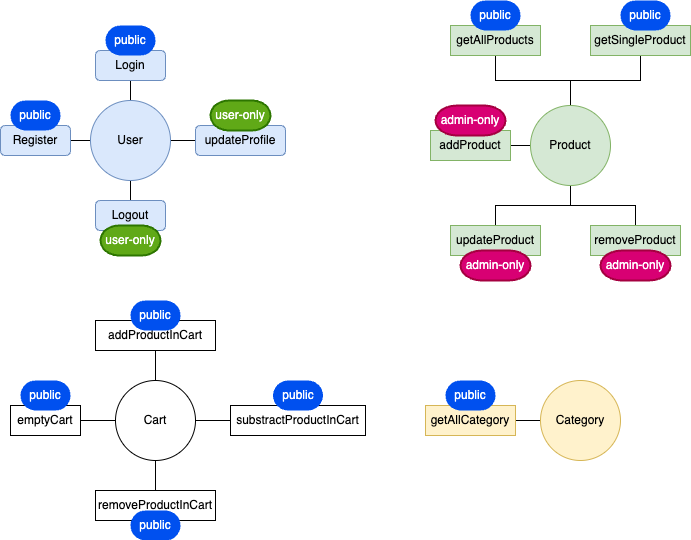

# Introduction

This is the frontend project of Integrify Fullstack programme 2023-08.

Deployed [here](https://xuefeng-frontend-project.vercel.app/)

## Table of content

- [Architecture](#architecture)
- [Technologies](#technologies)
- [Structures](#structures)
- [Getting started](#getting-started)

## Architecture

Data flow



Features



## Technologies

- Typescript
- React
- Material UI
- RTK Query
- Yup
- react-hook-form
- zustand
- react-hot-toast
- Jest for unit testing

## Structures

```
├── images
├── public
└── src
    ├── components
        ├── cart
        ├── dashboard
        ├── forms
        ├── header
        ├── home
        ├── modals
        ├── product
        └── products
    ├── hooks
    ├── libs
    ├── pages
    ├── providers
    ├── redux
        ├── reducers
        └── services
    ├── schemas
    ├── styles
    ├── test
        ├── redux
            ├── reducers
            ├── services
        └── shared
    └── types

```

## Getting started

1. Clone this repo using this command: `git clone -b xuefeng https://github.com/sirowood/fs16_6-frontend-project.git`
2. Under the root folder run this command: `npm install` to install dependencies
3. Create a `.env.local` file under the root folder, store your `REACT_APP_STRIPE_PUBLISHABLE_KEY` and `REACT_APP_STRIPE_SECRET_KEY` in it.
4. Run `npm start` to start the app
